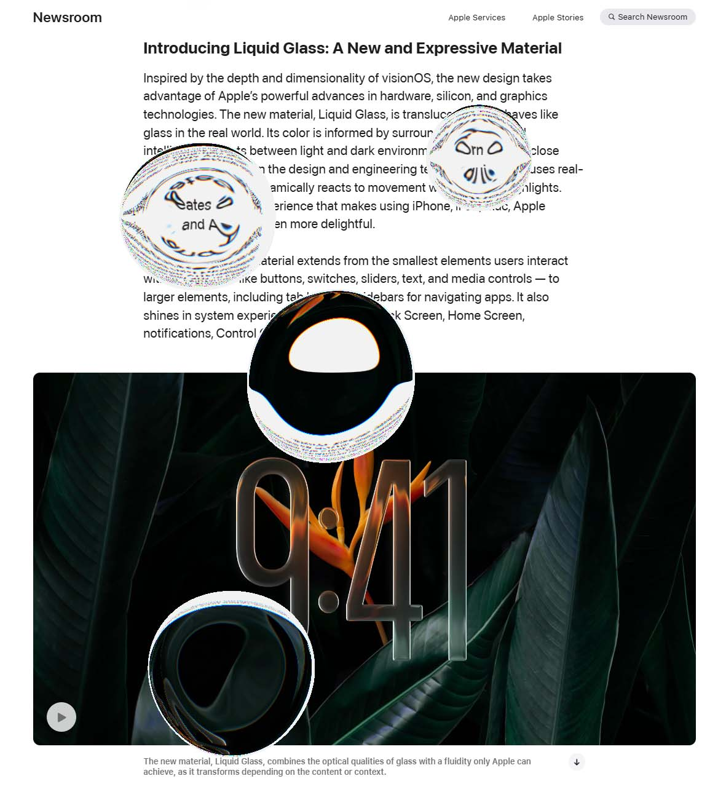
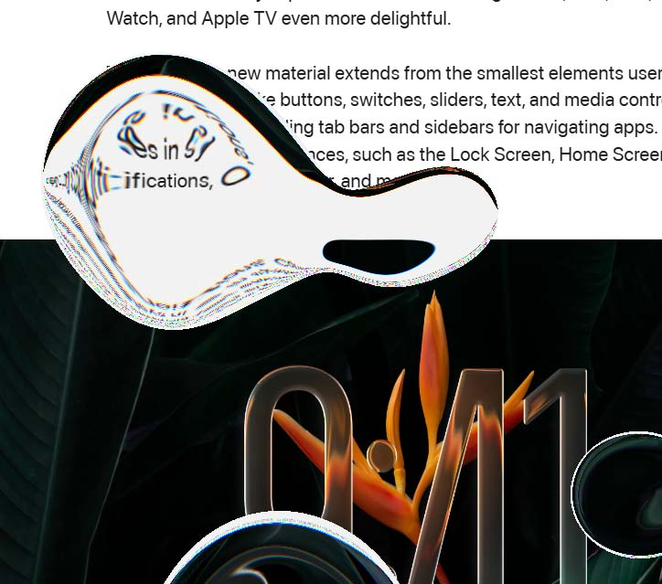

# Liquid Glass

A front-end interactive liquid glass effect developed based on JS and Three.js. Features realistic physical behaviors and rich motion effects.

The dynamic behavior is simulated using a particle system, with morphology based on the metaball algorithm, incorporating refraction and dispersion. GPU acceleration is supported.

Demo videos:

https://www.bilibili.com/video/BV1PhGLzhEAd/

https://www.bilibili.com/video/BV1XYGNzEEhJ/

Online demo：

https://shengzhiwu.github.io/liquid-glass

https://shengzhiwu.github.io/liquid-glass-slider

